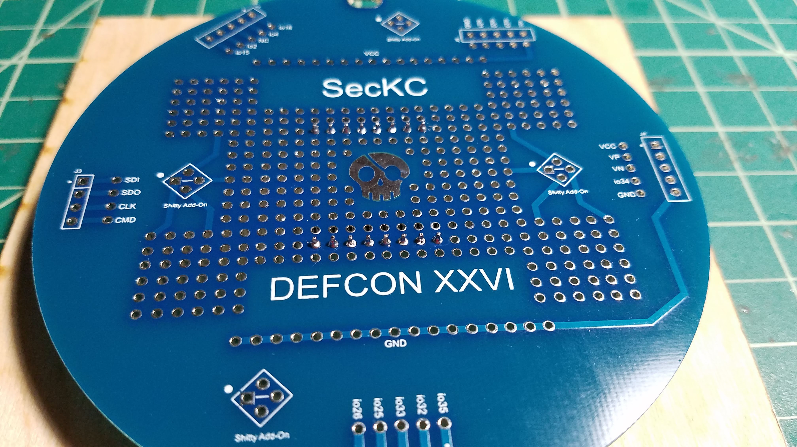
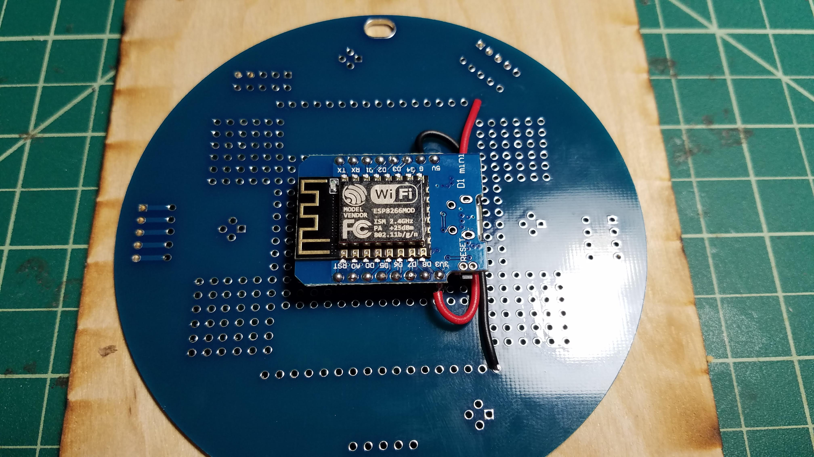
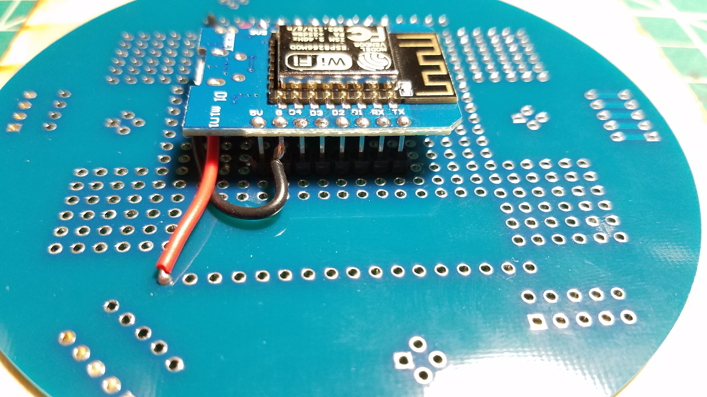
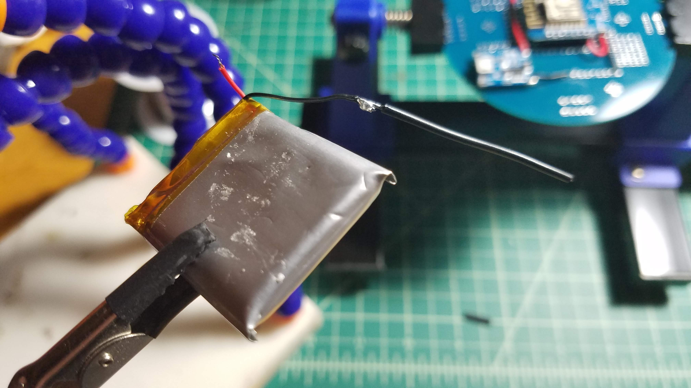
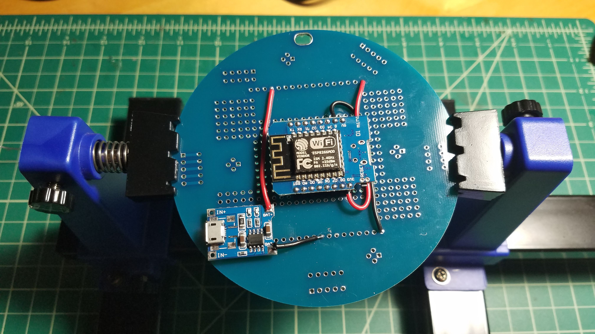
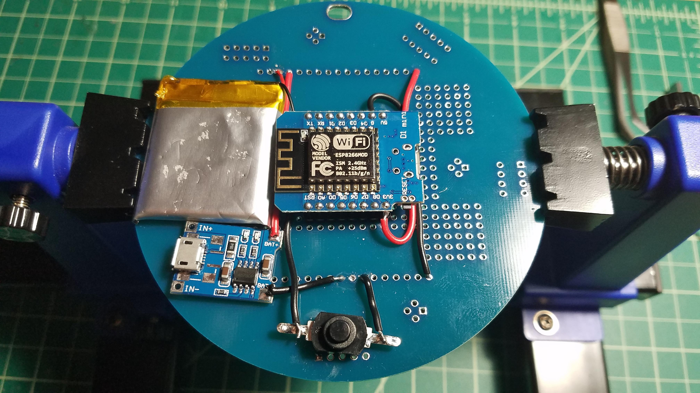
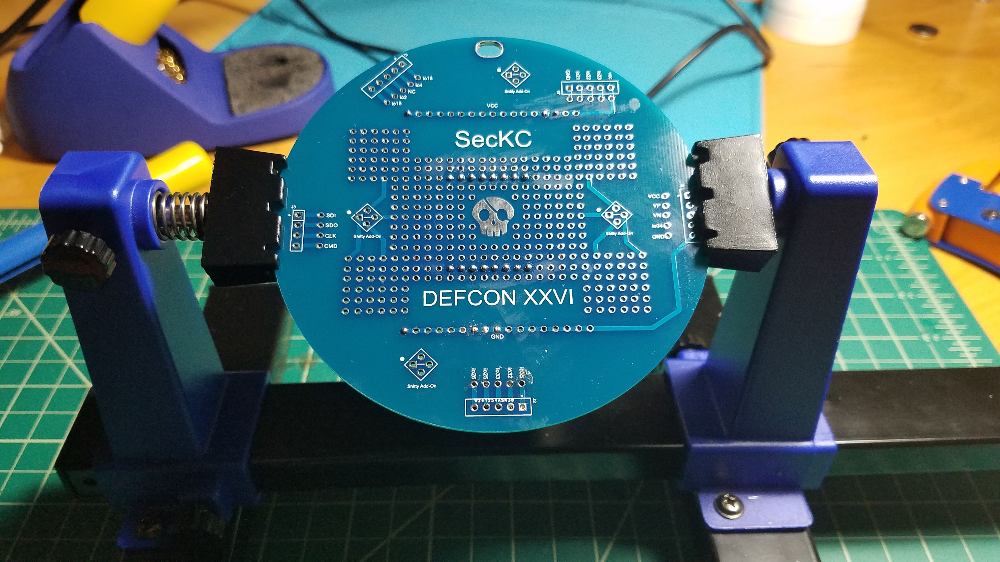

# BP DC26 Cotcha Standalone Badge Tutorial

So you got a DC26 Dev board and don't have any ideas on how to use it?  Why not take the AWESOME
[SecKC Cotcha](https://github.com/hevnsnt/cotcha) project designed by @hevnsnt and make it a wearable badge!

## Getting started

For this project you will need:

```
*  1x Cotcha (Wemos D1, Lipo Charger and 1s Lipo battery)
*  Bits of wire (solid core recommended)
*  Button (optional but recommended)
*  Header pins for Wemos D1
```

Tools:

```
*  Soldering iron
*  Solder
*  Wire strippers
```

### Deconstruct Cotcha

If you have a complete Cotcha, you first need to deconstruct it into its base pieces before you can begin.  You
can start with removing the battery.  

**WARNING**: Be careful not to touch the wires of the battery together as it will short it out and could
cause the battery to burst into flames.

You will also need to remove the ground and power wires going from the LiPo charger to the Wemos.

### Install the headers

Pick a spot on the board to install the headers for the WEMOS D1 to to connect to.  You can choose
to solder the headers on the WEMOS first to make sure that you get the alignment correct.

I would suggest holding WEMOS up giving you some space between the DEV board and the MCU
so that you can run wires underneath to the pins instead of brining them to the top of the MCU
as you will see when the VCC & GND wires are connected.


Installed WEMOS D1



The next step is to run connections from the VCC (3.3V) and GND lines on the DEV board.  It is
best practice to use red cabling for the VCC lines in DC circuits and black for GND.  The
DEV board has VCC and GND rails that are connected on the board so you can use any
hole on those lines to make your connections.

**NOTE:** One thing you might consider doing differently than what I did is to NOT connect
the VCC (3.3V) to the VCC lines but instead save it for the connection to the button.  If you do it
this way the device will not power on while you are trying to charge the battery.




Close up of the ground wire connecting underneath the board to the header pin.  This ensures
that when it rubs against your shirt the wire is not exposed.



## Installing the Lipo

If you are using a Cotcha from SECKC, the first thing you are going to find is that the leads
on the battery were trimmed to make the package as compact as possible.  For this project we
will be extending the GND wire as its positioning on the board only allows the positive to
reach the VCC line on the board.  Solder a short piece of black wire onto the black lead and
add some heat shrink tubing to cover the extension to protect it.




### LiPo Charger

The LiPo charing board need to have wires add to it to run to the VCC and GND lines on the board
so that it can provide power to the MCU and battery to charge it.  Route a red wire to the positive
lines and a black wire to the GND line on the DEV board.  


Finally you can install the LiPo on the board.  The red (positive) lead on the battery should
be connected directly to the VCC line on the board. The black (negative) lead should be connected
to the ground lines on the board. Use double sided foam tape to secure the battery to the board.


Completed board






## Authors

* **networkgeek** - Carl Fugate

## License

This project is licensed under the MIT License - see the [LICENSE.md](LICENSE.md) file for details

## Acknowledgments

* @hevnsnt for the AWESOME SECKC Cotcha
