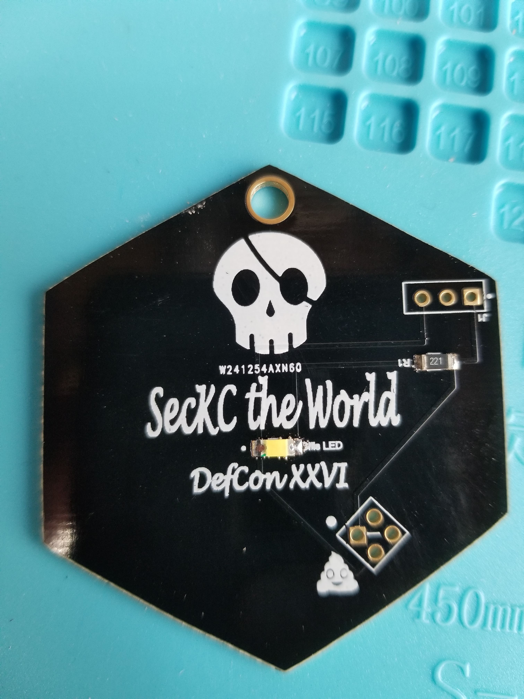

# SecKC the World SAO

First of all thank you for being a supporter of the very first (official) [SecKC](https://www.seckc.org) Defcon Party!
Your donation allowed us over 500 of your fellow hackers to have a great evening listening to some sick beats
laid down by [sysaaron](https://www.twitter.com/sysaaron) and [archwisp](https://www.twitter.com/archwisp)!

## The SAO

For this project you will need:

```
*  1x SecKC the World SecKCSAO
*  1x 1206 SMD LED
*  1x 1206 SMD 220ohm resistor
*  1x Badge Pirates DC26 Badge (optional)

```

Tools:

```
*  Soldering iron
*  Solder
*  Wire strippers (if adding to the BP DC26 badge)
*  Wire (if adding to the BP DC26 badge)
```

### Installing the SAO headers

The SAO has two differnet header options depending on whether you want to use the SAO (v1.0) header style
or if you have a BP DC26 badge a 3 pin male header that will cover the 'Bob' image on your badge and not
require you to use your SAO slot.



If you are only installing the SAO v1.0 style header, simply solder on a 2x2 male header and you are done!


### Installing the SMD components

The SMD components are sized to ensure that anyone with even introductory soldering skills should be able to
complete it.  When soldering SMD components it is advisable to first add solder (tin) one pad and then place
the component while heating that that pad to allow it to secure into place.  Once you have done this you can then
take solder and add to the other side to complete the circuit.

**NOTE:** When installing LED's remember that they are polarized and will at best not work and worst destroy the LED
if installed backwards.  You can use the diode test feature on a multimeter to determine which lead is the positive
(anode).

On the SAO PCB the white dot next to the pads indicates the anode (positive) side of the LED.  Solder the LED into place
followed by the resistor (which is not polarized) on the board to complete it.

#### Advanced BP DC26 Installation (@hevnsnt last-minute edition)

While we would like to say it was planned, it was complete luck that the SecKC SAO turned out to be
the perfect size to cover up the default 'Bob' image on the badge.  Additionally, in odds that approach
Powerball levels we happened to have 3 header pins that would allow the SAO to mount directly.  That
however was where our luck ran out.  The 3 pins (well 2 actually) were designed to allow us to program the
board by using a jumper.  One pin was was unused which would allow us (with a jumper wire) to grab power from
somewhere else on the board.

You can see in the image below that I used a jumper wire to go to the VCC pin on the upper left side of the
badge.  The connection on the 3 pin header is to the far right pin which you will see has no label will be
our makeshift VCC pin for the SAO.  Simply solder a wire between those two pins and your SAO will have power
for the LED.


When mounting the SAO, you will want to add some double-sided adhesive to help space it out on the edges as
the header wont prevent it from flexing on the other sides.  You can see below how it will provide a bit of a
backlit effect when installed.


## Authors

* **networkgeek** - Carl Fugate

## License

This project is licensed under the MIT License - see the [LICENSE.md](../LICENSE.md) file for details

## Acknowledgments

* @hevnsnt for the suggestion to redesign the SAO 3 days before the final order!
